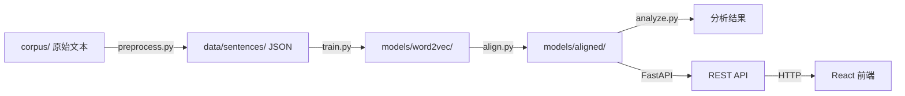

# DiachronicVec 重构架构方案

## 项目定位

一个面向西方哲学史的历时语义分析工具，支持从原始语料到交互式可视化的完整 pipeline。

---

## 技术选型

| 层级 | 技术 | 理由 |
|------|------|------|
| 语料处理 | spaCy (en_core_web_sm) | 高质量英文分词/词形还原，比简单 split 好得多 |
| 词向量训练 | gensim Word2Vec | 项目原有选型，成熟稳定 |
| 向量对齐 | numpy + scipy | scipy.linalg.orthogonal_procrustes 直接解决反射问题 |
| 后端 API | FastAPI | 轻量、自带 OpenAPI 文档、async 支持 |
| 前端 | React + Vite + Recharts + D3 | 现代工具链，Recharts 做标准图表，D3 做词向量散点 |
| 样式 | Tailwind CSS | 快速出漂亮 UI |
| 降维可视化 | scikit-learn (t-SNE/PCA) | 将高维向量投影到 2D 供前端展示 |

---

## 目录结构

```
DiachronicVec/
├── corpus/                          # 原始哲学文本（已有，按时期分目录）
│   ├── ancient/
│   ├── medieval/
│   ├── modern/
│   └── contemporary/
├── diachronic/                      # Python 核心包
│   ├── __init__.py
│   ├── config.py                    # 集中配置（时期定义、路径、超参数）
│   ├── utils.py                     # 公共工具（路径解析、余弦距离）
│   ├── preprocess.py                # 语料预处理（清洗 + spaCy 分词）
│   ├── train.py                     # Word2Vec 训练
│   ├── align.py                     # 正交 Procrustes 对齐（修复反射）
│   └── analyze.py                   # 语义分析（漂移、近邻、Jaccard 等）
├── api/                             # FastAPI 后端
│   ├── __init__.py
│   ├── main.py                      # FastAPI app 入口
│   └── routers/
│       ├── __init__.py
│       ├── analysis.py              # 分析相关 API
│       └── corpus.py                # 语料信息 API
├── web/                             # React 前端
│   ├── package.json
│   ├── vite.config.js
│   ├── index.html
│   ├── src/
│   │   ├── main.jsx
│   │   ├── App.jsx
│   │   ├── api/
│   │   │   └── client.js            # API 调用封装
│   │   ├── components/
│   │   │   ├── Layout.jsx           # 页面布局
│   │   │   ├── DriftChart.jsx       # 语义漂移折线图
│   │   │   ├── JaccardChart.jsx     # Jaccard 相似度柱状图
│   │   │   ├── NeighborTable.jsx    # 近邻演化表
│   │   │   ├── ScatterPlot.jsx      # 词向量 2D 散点图
│   │   │   ├── WordExplorer.jsx     # 词汇搜索与探索面板
│   │   │   └── TopDrifters.jsx      # 漂移排行榜
│   │   └── styles/
│   │       └── index.css
│   └── tailwind.config.js
├── models/                          # 训练产物（gitignore）
│   ├── word2vec/
│   └── aligned/
├── data/                            # 预处理产物（gitignore）
│   └── sentences/
├── results/                         # 分析输出（gitignore）
├── plans/                           # 架构文档
├── pyproject.toml                   # Python 依赖与项目元数据
├── .gitignore
├── README.md
└── run.py                           # 统一 CLI 入口
```

---

## 数据流架构



---

## 核心模块设计

### 1. config.py — 集中配置

所有硬编码常量统一管理：

- `PERIODS`: 时期列表及其元数据（名称、年份、min_count）
- `PATHS`: 各目录路径，基于项目根目录解析
- `TRAINING`: Word2Vec 超参数（vector_size, window 等）
- `ANALYSIS`: 默认目标词、top_n 等

### 2. preprocess.py — 语料预处理

替代原有的 `processed_corpus/` JSON 文件：

- 读取 `corpus/{period}/` 下所有 `.txt` 文件
- 用 spaCy 做分句 + 分词 + 词形还原（lemmatization）
- 过滤停用词、标点、过短 token
- 清理 Project Gutenberg 头尾元数据
- 输出 `data/sentences/{period}_sentences.json`

### 3. align.py — 修复 Procrustes 对齐

关键修复：使用 `scipy.linalg.orthogonal_procrustes` 替代手写 SVD，该函数内部已正确处理反射问题。或者手动添加行列式检查：

```python
U, _, Vt = np.linalg.svd(covariance)
d = np.sign(np.linalg.det(U @ Vt))
correction = np.diag([1] * (n-1) + [d])
rotation = U @ correction @ Vt
```

### 4. analyze.py — 分析引擎

重构要点：
- 抽取 `cosine_distance` 为公共方法
- `find_top_drifters` 向量化计算
- 所有方法返回数据而非直接绘图（绘图交给前端）
- 新增 `get_2d_projection` 方法（PCA/t-SNE 降维）供散点图使用

### 5. API 设计

```
GET  /api/periods                          # 获取时期列表及元数据
GET  /api/corpus/stats                     # 语料统计信息
GET  /api/vocab?period=ancient             # 获取某时期词汇表
POST /api/analysis/drift                   # 计算语义漂移
     body: {words: [...], benchmark: "modern"}
POST /api/analysis/neighbors               # 获取近邻演化
     body: {word: "reason", top_n: 10}
POST /api/analysis/jaccard                 # Jaccard 相似度
     body: {word: "god", top_n: 50}
GET  /api/analysis/top-drifters            # 漂移排行榜
     ?start=ancient&end=contemporary&n=20
POST /api/analysis/scatter                 # 2D 散点投影
     body: {words: [...], method: "pca"}
```

### 6. 前端页面设计

单页应用，左侧导航 + 右侧内容区：

- **Dashboard**：项目概览、语料统计、快速入口
- **Semantic Drift**：选择词汇 → 展示漂移折线图（Recharts）
- **Neighbor Evolution**：输入词汇 → 四列表格展示各时期近邻
- **Jaccard Overlap**：选择词汇 → 柱状图展示相邻时期重叠度
- **Vector Space**：交互式 2D 散点图（D3），可选时期、可搜索词汇
- **Top Drifters**：排行榜视图，展示语义变化最大的词

配色方案：深色学术风格，四个时期用不同色系区分：
- Ancient: 琥珀色 #D97706
- Medieval: 靛蓝色 #4F46E5
- Modern: 翠绿色 #059669
- Contemporary: 玫红色 #DB2777

---

## 统一 CLI 入口

`run.py` 使用 argparse 提供子命令：

```bash
python run.py preprocess          # 预处理语料
python run.py train               # 训练 Word2Vec
python run.py align               # 对齐模型
python run.py analyze             # 运行分析（命令行输出）
python run.py serve               # 启动 FastAPI 后端
python run.py pipeline            # 一键执行 preprocess -> train -> align
```

---

## 实施阶段

### Phase 1: 项目基础设施
- 创建 `pyproject.toml`（依赖：gensim, numpy, scipy, spacy, fastapi, uvicorn, scikit-learn, pandas）
- 创建 `.gitignore`（忽略 models/, data/, results/, __pycache__, node_modules, .venv）
- 创建 `diachronic/config.py` 和 `diachronic/utils.py`

### Phase 2: 语料处理 Pipeline
- 实现 `diachronic/preprocess.py`，从 `corpus/` 读取原始文本
- spaCy 分句分词 + 词形还原 + 清洗
- 输出到 `data/sentences/`
- 删除旧的 `processed_corpus/` 和 `scripts/` 目录

### Phase 3: 核心引擎重构
- 重写 `diachronic/train.py`（从 config 读取参数）
- 重写 `diachronic/align.py`（修复反射问题，向量化）
- 重写 `diachronic/analyze.py`（数据返回而非绘图，向量化计算，新增降维）
- 实现 `run.py` CLI 入口

### Phase 4: FastAPI 后端
- 实现 `api/main.py` 和各 router
- 模型在启动时加载到内存
- CORS 配置支持前端开发

### Phase 5: React 前端
- 初始化 Vite + React + Tailwind 项目
- 实现各可视化组件
- 深色学术风格 UI

### Phase 6: 集成与文档
- 更新 README.md
- 端到端测试 pipeline
